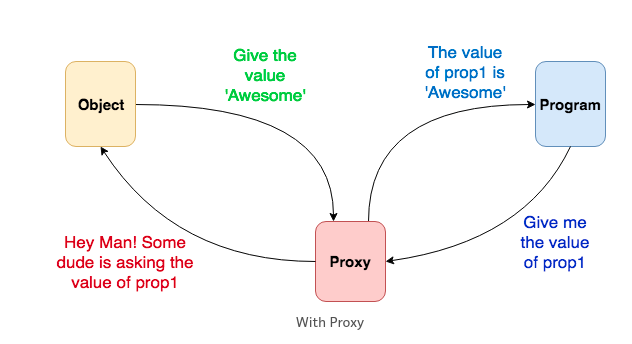

# Proxy pattern

picture here

## La teoría

El `Proxy pattern` es un patrón estructural que permite proporcionar un sustituto al Objeto-Principal (servicio/objeto). Pudiendo gestionar la entrada y salida de sus peticiones e incluso añadir nueva funcionalidad sin tener que modificar el objeto original.

## ¿Para qué lo deberia de usar?

De primeras, puede parecer que el `Proxy pattern` es una estrategia overkill, pero todo lo contrario, es una gran solución a la hora de extender código, mantener el código limpio y mejorar la performance de tu aplicación.

Normalmente querremos usar el `Proxy pattern` cuando: Necesitemos comunicarnos con un servicio/objeto externo, controlar operaciones pesadas y posponer la carga de procesos pesados para aumentar la performance de la aplicación.

También nos permitirá: Controlar los accesos del Objeto-Principal, suspender la petición/datos hasta que el Objeto-Principal este listo y poder limitar el número de llamadas que se le hacen.

Por último remarcar que, es un poderoso aliado para desacoplar el código del Objeto-Principal y extender la implementación actual.



## ¿Se puede usar en JS?

El `Proxy pattern` es de esas cosas en la vida que, sin saberlo, siempre han estado presentes. Tras investigar y aprender este patrón, confirmo solemnemente que, como front-developer, lo he estado usando sin darme cuenta.

## Analogía en el mundo real

Personalmente, me gusta mucho asociar los nuevos conceptos que voy aprendiendo a situaciones o herramientas reales y cotidianas. En el caso del Proxy pattern se pone el ejemplo del CreditCard & Cash. Siendo `Cash` el Objeto-Principal, `CreditCard` el proxy y `IPayment` su razón de ser.

Para aclararlo: Cuando usamos CreditCard, aunque no llevemos el dinero encima, ni el riesgo que supondría tenerlo en los bolsillos, podemos seguir usando Cash mediante su proxy (CreditCard).


## ¿Que es obj Proxy() de JS? ¿Lo he de usar siempre?

La especificación de `Proxy()` es actualmente un estándar de JS y está soportado en los navegadores más destacados (no cuento con nuestro buen amigo Internet Explorer).

Sin entrar mucho al detalle, para no enrollarme, gracias a la API que nos proporciona el obj `Proxy()` algunas de las implementaciones del patron se veran beneficiadas y rapidamente solventadas. Pero, no lo usaremos siempre. Aparte, desde mi punto de vista, genera confusion y le añade complejidad de legibilidad al codigo.

> Aunque lo veremos en los ejemplos, te invito a que [busques información](https://developer.mozilla.org/es/docs/Web/JavaScript/Reference/Global_Objects/Proxy) al terminar la lectura

## Implementaciones

Por suerte o por desgracia, no solo tiene un único propósito ni un único marco de uso. Puedes usarlo para solventar alguna de tus casuísticas del día a día como desarrollador/a.

- `Virtual Proxies`: Nos permite inicializar el Objeto-Principal cuando sea realmente necesario. En los casos en que la construcción del Objeto-Principal aplique una sobrecarga a nuestra CPU, el `Virtual Proxy` puede ser una buena solución. Tiene sentido librar segundos de ejecucion instanciando el Objeto-Principal, solo y únicamente cuando el cliente lo requiera.

> ejemplo en ./virtualProxy.js

```js
class LibraryProxy {
  constructor(addres, ref) {
    this.library = null;
  }

  _init() {
    this.library = !this.library ? new Library() : this.library;
  }

  searchBook(title) {
    this._init();
    this.library.searchBook(title);
  }

  getBook(book) {
    this._init();
    this.library.getBook(book);
  }
}

const library = new LibraryProxy();

// here will init Library and getBook
library.getBook({ title: `Rebelion en la granja`, author: `george Orwell` });
```

- `Protection Proxies`: Es una capa de seguridad que le aplicamos a nuestro Objeto-Principal. Pudiendo controlar el acceso (setters and getters) de las propiedade o metodos.

> ejemplo en ./protectionProxy.js

```js
const dog = {
  _privateProp: 42,
};

const handler = {
  has: function (target, key) {
    return !(key.startsWith("_") && key in target);
  },
  get: function (target, key, receiver) {
    return key in receiver ? target[key] : undefined;
  },
};

const privateDog = new Proxy(dog, handler);
privateDog._privateProp; // undefined
```

- `Remotes Proxies`: Se crea una representación Local del Objeto-Principal, cuya localización de la logica no es el mismo Local sino en Remoto(Ej: en una API/servidor).

> ejemplo en ./remotePorxy.js

```js
// The real Library service is contained on the server, so
// LibraryProxyRemote gets the information from the server

class LibraryProxyRemote {
  constructor(baseUrl) {
    this._baseUrl = baseUrl;
  }

  async search(name) {
    const response = await fetch(this._baseUrl + `/resources?sungby=${name}`);

    if (response.ok) {
      return response.json();
    }
  }
}

const library = new LibraryProxyRemote("https://api-rv.herokuapp.com/rv/v1");
```

- `Cache Proxies`: Si nuestro Objeto-Principal usa una gran cantidad de recursos a la hora de calcular operaciones o hacer ciertas peticiones al exterior (APIs). Podemos añadir una capa de lógica y encapsular nuestro Objeto-Principal en un proxy encargado de cachear algunas de nuestras operaciones, o peticiones exteriores (memo). Sin la necesidad de modificar el Objeto-Principal, siguiendo el paradigma Open-Close.

> ejemplo en ./cacheProxy.js

```js
let memoData = {};

class LibraryProxyRemote {
  constructor(baseUrl) {
    this._baseUrl = baseUrl;
  }

  async search(name) {
    if (memoData[name]) {
      return memoData[name];
    }

    const response = await fetch(this._baseUrl + `/resources?sungby=${name}`);

    if (response.ok) {
      const data = await response.json();
      memoData[name] = data;

      return data;
    }
  }
}

const library = new LibraryProxyRemote("https://api-rv.herokuapp.com/rv/v1");
```

## Pros

- Facilita el Open-Close del principioSOLID. Puedes extender la implementacion de objeto sin necesidad de moficarlo.

- El proxy funciona incluso si el Objeto-Principal no está listo o no está disponible.

## Contras

- Aumenta la complejidad de la legibilidad del código (en algunos casos)

- Las respuestas pueden ralentizarse (en caso del virtual proxy)

## Guide

[https://dzone.com/articles/design-patterns-proxy](https://dzone.com/articles/design-patterns-proxy)

[https://stackoverflow.com/questions/37692814/what-is-the-exact-difference-between-adapter-and-proxy-patterns](https://stackoverflow.com/questions/37692814/what-is-the-exact-difference-between-adapter-and-proxy-patterns)

[https://www.joezimjs.com/javascript/javascript-design-patterns-proxy/](https://www.joezimjs.com/javascript/javascript-design-patterns-proxy/)

[https://www.oodesign.com/proxy-pattern.html](https://www.oodesign.com/proxy-pattern.html)

[https://www.joezimjs.com/javascript/javascript-design-patterns-proxy/](https://www.joezimjs.com/javascript/javascript-design-patterns-proxy/)

[https://blog.logrocket.com/practical-use-cases-for-javascript-es6-proxies/](https://blog.logrocket.com/practical-use-cases-for-javascript-es6-proxies/)

[https://refactoring.guru/es/design-patterns/proxy](https://refactoring.guru/es/design-patterns/proxy)

[https://stackoverflow.com/questions/7379732/what-is-a-javascript-proxy-pattern](https://stackoverflow.com/questions/7379732/what-is-a-javascript-proxy-pattern)
